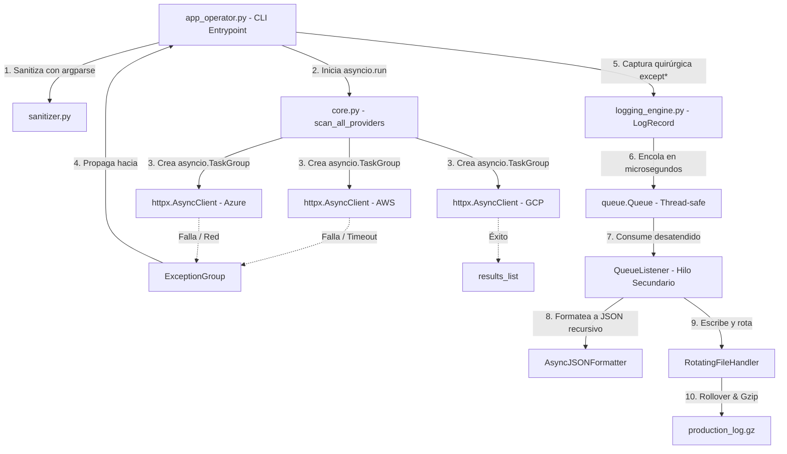

# Proyecto Tritón

Sistema de Telemetría Multicloud y Observabilidad Asíncrona

### Características

- Consulta estados de los clústeres en tiempo real.
- Muestreo de datos legible para el humano.
- Ejecución asíncrona mediante asyncio.

### Tecnologías

- Python
- pip
- asyncio
- httpx

### Requisitos

- Python 3.11 o superior

## Instalación

1.  Clonar el repositorio

    1. Ve a la carpeta donde quieres guardar el proyecto:
        
        ```bash
        cd ruta/de/la/carpeta
        ```
    2. Clona el repositorio:
        
        ```bash
        git clone git@github.com:leoventicola/TP1-Triton-project.git
        ```
    3. Entra al proyecto:
        
        ```bash
        cd TP1-Triton-project
        ```

2. Instalar dependencias
    
    1. Crear el entorno virtual

        Dentro de la carpeta del proyecto:
        
        - Windows:

          ```bash
          python -m venv .venv
          ```
        
        - Linux / macOS:

          ```bash
          python3 -m venv .venv
          ```
        
        Esto crea una carpeta llamada `.venv`.
    
    2. Activarlo

        - Windows (CMD):
        
          ```bash
          .venv\Scripts\activate
          ```

        - Windows (PowerShell):

          ```bash
          .\.venv\Scripts\Activate.ps1
          ```

        - Linux / macOS:
            
          ```bash
          source .venv/bin/activate
          ```
        
          Cuando esté activado, normalmente verás algo como:

            ```bash
            (.venv) $
            ```

    3. Instalar paquetes:
    
        Con el entorno activado:

          ```bash
          pip install -r requirements.txt
          ```

[# Cómo Usar]:#

---

## Calidad y pruebas

El proyecto cuenta con pruebas automatizadas y herramientas de análisis estático
(Flake8 y Pylint) para verificar su correcto funcionamiento y mantener la
calidad del código.

Para conocer cómo ejecutar las pruebas y las herramientas de análisis,
consultar [CONTRIBUTING.md](CONTRIBUTING.md).

---

##  Diagrama de Arquitectura de Telemetría
El siguiente flujo conceptual ilustra cómo interactúan las corrutinas asíncronas de telemetría, el agrupamiento de excepciones concurrentes, la cola segura en memoria y el formateador recursivo JSON para persistir los volcados comprimidos:



## Cómo Usar

### Ejemplos:

#### Escenario A: Operación Nominal Completa (Éxito Rotundo)

Lanzamos una **consulta asíncrona hacia AWS y GCP** fijando un rango seguro de `timeout` y un formato de ID de clúster válido:

```bash
python src/app_operator.py AWS GCP -c cluster-us-east-01 -t 3.0
```

#### Escenario B: Validación Temprana de Argumentos Fallida (Frontera CLI)

Intentamos **ejecutar inyectando un ID de clúster mal formulado** o un `timeout` absurdo fuera de rango:

```bash
python src/app_operator.py AWS GCP -c cluster-invalido-id -t 9.5
```

#### Escenario C: Inyección de Caos (Fallos Concurrentes y Árbol `ExceptionGroup`)

Forzamos la ocurrencia de incidentes de red reales en caliente activando la bandera **`--chaos`** y **limitando el tiempo de espera a `1.5` segundos** (provocará que **`AWS`** colapse por **`timeout`** en **`httpbin`**, **`GCP`** falle por formato de payload corrupto al devolver **`XML`** e inyectará un código **`504`** a **`Azure`**):

```bash
python src/app_operator.py AWS Azure GCP -c cluster-us-west-02 -t 1.5 --chaos
```

---

## Equipo de desarrollo

### Equipo 404

- Integrante 1: [Cointte Cedron, Mateo](https://github.com/Th-30Mateo)
- Integrante 2: [Mamaní, Cristian Alfredo](https://www.github.com/mamanicristian92)
- Integrante 3: [Choque, Ismael Alejandro](https://www.github.com/ismahack7)
- Integrante 4: [Venticola, Leandro Enrique](https://github.com/leoventicola/)
- Integrante 5: [Martinez, Gustavo Alejandro](https://www.github.com/)
- Integrante 6: [Lescano, Jessica Daiana](https://www.github.com/daylagitana89jl-oss)

### Video de presentación

[Link a YouTube](https://www.youtube.com/watch?v=gyBi8WcGG2Y)
